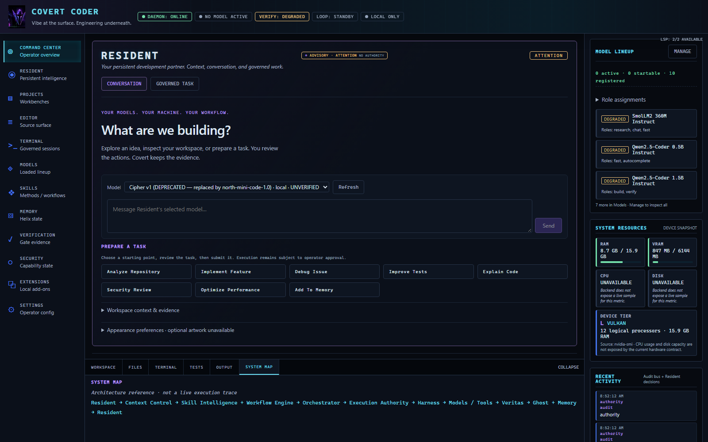

<div align="center">
  
  <h1>COVERT CODER</h1>
  <p><strong>Vibe at the surface. Engineering underneath.</strong></p>
  <p>Local by default. Connected by choice.<br />Your models. Your machine. Your workflow.</p>
</div>

[](https://github.com/AnonymousNomad/covert-coder/actions/workflows/ci.yml?query=branch%3Acovert-production)
[](LICENSE)
[](docs/RELEASE_ROADMAP.md)
[](docs/evidence/final-cockpit-baseline.json)

Covert Coder is an open-source, local-first engineering workbench for developers who want control over their models, context, and execution.



*Real application, not a mockup. Unavailable model runtimes and missing evidence remain visible. [Capture provenance and additional views](docs/assets/screenshots/README.md). This branch is a pre-production release candidate, not a certification of every backend subsystem.*

## Quickstart

Use **Node.js 26.4.0** (the CI reference runtime), npm, and Git. Native PTY dependencies may require platform build tools. Model weights and a compatible local inference runtime are separate prerequisites for local chat; opening the workbench does not require downloading weights.

```bash
git clone https://github.com/AnonymousNomad/covert-coder.git
cd covert-coder
git switch covert-production
npm ci
npm run doctor
npm start
```

Open **http://127.0.0.1:4173/**. In the terminal running Covert, type `pair`, then enter its one-use code in the browser. Pairing identifies the operator; it does not approve individual operations.

Use **Settings → Run Adaptive Setup** to inspect and plan configuration. Review the proposed changes before approving them. If a model, runtime, or verification result is unavailable, setup must show the remaining action rather than declare the workspace ready.

To evaluate this unmerged cockpit candidate, switch to `feat/final-cockpit-production-ui` instead of `covert-production` before installing. [Installation, pairing, and troubleshooting](docs/GETTING_STARTED.md).

## Why Covert

A coding assistant needs more than a chat box. It needs a real workspace, a bounded context, an explicit execution boundary, and evidence that survives the answer.

Resident is the persistent intelligence surface of the workbench. Monaco remains the engineering editor; the terminal is a real, governed PTY. Models and tools are replaceable participants, not owners of the operator's authority.

The lightweight native Resident / Cipher direction is a product architecture goal, not a claim that a bundled house model is production-ready. Local execution, provider choice, independent verification, and provenance are designed as separate concerns so a model's confident answer cannot substitute for permission or evidence.

## Capabilities and maturity

**Available** means an exposed path exists with relevant verification; it is not a blanket production claim. **Partial** means important boundaries remain. **Experimental** means acceptance or portability is limited. **Planned** is not implemented.

| Surface | Maturity | What the current UI actually exposes |
| --- | --- | --- |
| Command Center / Resident | Available / experimental intelligence | Workspace observations, conversation, governed task requests; Resident has no authority |
| Projects / Editor | Available | Workspace files, Monaco tabs, splits, modified state, search and diagnostics |
| Terminal | Available, platform-dependent | Operator-approved, actor-bound PTY sessions; honest provider availability |
| Models | Available, runtime-dependent | Inventory, start/stop controls, route evidence; artifact presence is not READY |
| Adaptive Setup | Available, capability-dependent | Inspect, plan, approve, apply, verify, and action-required states |
| Skills / Workflow Engine | Partial | Current workflow evidence; no invented skill activation or mode execution |
| Memory / Ghost | Experimental | Explicit digest retrieval and persistence boundaries; retrieval is not proof of effective recall |
| Verification / Veritas | Partial UI; verification tooling available | Claim, evidence, and verdict separation; unscoped historical passes do not verify current work |
| Security | Partial | Pairing state and governed-operation boundary; no fabricated aggregate containment score |
| Providers | Partial / experimental | Existing configuration and connection surfaces; configuration is not runtime readiness |
| Extensions | Not available in this cockpit | Explicitly phase-gated; no installation or extension authority implied |
| Harness Modes | Planned dynamic composition | One canonical Harness; domain loading is not implemented by an appearance selector |
| Desktop releases | Experimental | Historical packages do not certify the current browser cockpit |

## Architecture

The intended governed loop is:

```text
User → Resident / Cipher → Context Control
     → Skill Intelligence + Workflow Engine → Orchestrator
     → Execution Authority → Harness → Models / Tools
     → Veritas → Ghost + Memory → Resident
```

These components have different maturity levels; the diagram expresses responsibility, not universal completion.

The running product has one façade: browser frontend **4173** → product edge **4777** → canonical TypeScript services **4778**, with legacy services **4779** retained as migration inventory. Local model engines use separate private runtime ports.

[Canonical architecture](docs/ARCHITECTURE.md) · [Harness Modes contract](docs/HARNESS_MODES.md)

## Verification and governance

Resident may request governed work. It does not grant authority. Pairing credentials stay out of model context; individual operations require the existing exact-operation approval path. An approval is not a verification verdict, and a verdict is not permission.

Veritas owns verification evidence. The cockpit distinguishes a claim, its evidence, and a verdict. An agent saying “done,” an available test script, or a historical pass is not enough to paint current work green.

Frontend checks:

```bash
npx tsc -p browser/tsconfig.browser.json
npx eslint .
npm run build:frontend
node scripts/cockpit-acceptance.mjs
```

The cockpit acceptance driver currently uses locally installed Microsoft Edge. `npm run check:arch` runs the wider type/lint/architecture battery. Real-stack review drivers are documented in the [capture notes](docs/assets/screenshots/README.md); fixture tests and live-product evidence are kept separate.

## Local models and providers

Weights are not included. Consult [model packs](models/PACKS.md) and [operations](docs/OPERATIONS.md) for runtime and artifact requirements. The Models surface preserves **AVAILABLE, STARTABLE, STARTING, RUNNING, READY, DEGRADED, STOPPED, FAILED**.

Online providers and model downloads are explicit network choices. Enabling a provider may send selected request content to that provider. Stored credentials or installed CLIs do not establish a live connection.

## Documentation

[Documentation index](docs/README.md) · [Getting started](docs/GETTING_STARTED.md) · [Architecture](docs/ARCHITECTURE.md) · [Veritas / Harness](docs/VERITAS_HARNESS.md) · [Release notes](CHANGELOG.md) · [Release roadmap](docs/RELEASE_ROADMAP.md)

## Security

Read [SECURITY.md](SECURITY.md) before using private source or external providers. Keep secrets, capability material, personal data, and private source out of issues and screenshots. Use the repository's private vulnerability-reporting channel for sensitive reports.

## Contributing

See [CONTRIBUTING.md](CONTRIBUTING.md), [support guidance](SUPPORT.md), and [code of conduct](CODE_OF_CONDUCT.md). Preserve backend contracts, keep changes bounded, and attach verification evidence rather than claiming readiness from source alone.

## Current limitations

- This is pre-production. The CI badge above describes the production branch, not this unmerged candidate.
- No inference artifact was installed for this cockpit review. Real model generation is not certified by UI or fixture stream tests.
- CPU utilization and disk capacity are not exposed by the current hardware contract; the cockpit shows them as unavailable.
- Dynamic Harness Modes, full skill activation, aggregate security telemetry, and current-task verification correlation remain incomplete.
- Durable memory availability does not prove that a later model used the right memory. Native lightweight Resident remains a direction, not a shipped-model claim.
- The legacy end-to-end suite includes retired-shell selectors; use current cockpit checks for this surface and retain broader release gates.
- Desktop packages and other operating systems need their own acceptance. Historical AIDE names in source identifiers, architecture records, and old release artifacts are lineage, not a second public product.

## License

[Apache-2.0](LICENSE). [Third-party notices](THIRD_PARTY_NOTICES.md) cover the bundled font and dependency boundaries. Third-party tools and models retain their own licenses. No model weights or runtime binaries are redistributed by this UI pass.
