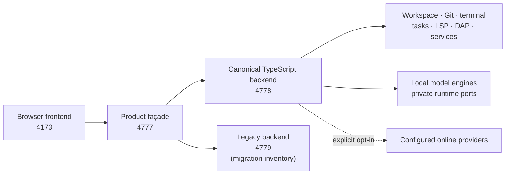

# Covert Coder

Your models. Your machine. Your workflow.
Local by default. Connected by choice.
Vibe at the surface. Engineering underneath.

**Sovereign Development Environment · AIDE Sovereign Workbench lineage**

Covert Coder is the product direction for AIDE Sovereign Workbench: an open-source, local-first development environment for engineers who want an editor, models, Git, debugging, and verification under their control.

> **Status:** pre-production engineering release. Capability labels below describe tracked source and documented routes; uncommitted work is not release evidence.

[](https://github.com/AnonymousNomad/covert-coder/actions/workflows/ci.yml?query=branch%3Acovert-production)
[](LICENSE)
[](https://github.com/sponsors/anonymousnomad)

## What it is

AIDE provides a governed development loop around the project and its evidence. Resident proposes context and actions; the operator reviews plans and diffs; typed services expose workspace, model, Git, terminal, language, debugging, and verification capabilities. Local execution is the default. Connected providers and model downloads are explicit network choices, not implied by installation.

**Vibe at the surface. Engineering underneath.**

## Who it is for

- Developers who want local model assistance around a real codebase.
- Privacy-conscious teams that need an explicit boundary for network access.
- Offline or air-gapped environments using locally imported models and tools.
- Researchers evaluating governed, human-reviewed coding workflows.

## Current capability matrix

| Capability | Status | Evidence / boundary |
| --- | --- | --- |
| Browser workbench, editor, workspace, search, chat | Implemented | `browser/src`, typed services under `node/src/routes/` |
| Git, terminal, tasks, TypeScript LSP, Python DAP | Implemented | `git`, `terminal`, `tasks`, `lsp`, and `dap` route families |
| Resident context and decisions | Experimental | `/api/resident`; state is advisory and does not grant execution authority |
| Local models, provider routing, and BYOK | Implemented / opt-in | `/api/models`, `/api/providers`, `/api/byok`; credentials remain daemon-side |
| Memory / Helix | Experimental | `/api/memory`; current public claims are limited to the verified subset |
| Veritas and evidence gates | Implemented as tooling | `harness/`, `docs/VERITAS_HARNESS.md`; verification is not an execution permission |
| Plugins and workbench bundles | Experimental | `/api/plugins`, `/api/workbenches`; trust and capability boundaries remain explicit |
| Desktop packaging and bounded desktop control | Experimental | Historical AIDE installers exist under [releases](https://github.com/AnonymousNomad/covert-coder/releases); they do not establish acceptance of the current Covert cockpit |
| Dedicated Skills, Security, and hardware telemetry surfaces | Not yet exposed | Do not infer capability from route names or repository files |
| Covert cockpit composition | Experimental | Source in `browser/src/cockpit`; validated by `scripts/cockpit-acceptance.mjs` on the current tree; not advertised as shipped until its release gate |

Status labels are deliberately conservative. A route, model file, or visual placeholder is not by itself proof of readiness, authority, ownership, or successful runtime behavior.

H2 process/tool ownership remains architecture-gated and is not production-promoted. Historical release assets and tags retain their AIDE identity; this documentation does not certify them against the current development branch.

## Architecture

The current development topology is a browser frontend, a single product façade, a canonical TypeScript backend, and a legacy backend retained as migration inventory. New user-facing behavior is expected to travel through the façade.



See [the canonical architecture document](docs/ARCHITECTURE.md) for route ownership, migration boundaries, and verification tiers. The legacy backend is not a second product surface.

## Privacy and security boundary

- Services bind to loopback by default. Loopback is a transport boundary, not a blanket guarantee that user-selected content can never leave the machine.
- Local models and local tools can run without cloud credentials. Model Hub search/download and configured online providers are network operations and must be treated as explicit operator choices.
- When online providers are enabled, the provider receives the content selected for that request. Review the provider boundary before enabling it.
- Provider credentials are held by the daemon and protected according to the platform implementation; they are not intended for browser state or logs.
- Model-generated changes remain proposals until the operator reviews and approves the resulting diff or action.
- Imported models, plugins, dependencies, and generated artifacts are untrusted inputs.

Read [SECURITY.md](SECURITY.md) before running the workbench with private source or external providers. Report suspected vulnerabilities through [GitHub private vulnerability reporting](https://github.com/AnonymousNomad/covert-coder/security/advisories/new), not public issues.

## Quickstart

Use Node.js **26.4.0**, the pinned CI runtime, for this development checkout. The package still declares `>=20`; that compatibility declaration is not proof that the current TypeScript execution and verification paths pass on Node 20. Local chat additionally requires a compatible `llama-server` binary and a locally available GGUF model.

```bash
git clone https://github.com/AnonymousNomad/covert-coder.git
cd covert-coder
git switch covert-production
npm install
npm run doctor
npm start
```

Open `http://127.0.0.1:4173/`. The doctor command reports missing runtime binaries and model artifacts; it does not download private assets or create authority.

## Verification

Run the commands appropriate to the surface you changed:

```bash
npm run check:arch
npm run build:frontend
npm run test:e2e
```

`check:arch` includes Node/browser typechecking, ESLint, and the architecture battery. Hardware-dependent checks may require local model or language-server artifacts. Do not convert a skipped or environment-gated check into a passing claim without its evidence.

## Model packs and network choices

Public model-pack metadata lives in [models/PACKS.md](models/PACKS.md); weights are not stored in this repository. Local GGUF import is supported. Search and download from external model hosts, and calls to configured online providers, are separate opt-in network boundaries.

## Reproducibility and evidence

- `common/` contains shared typed contracts and generated API descriptions.
- `harness/` contains model-independent verification and operating gates.
- `capsules/` describes portable evidence and runtime metadata without exporting private source by default.
- `benchmarks/` contains smoke-suite definitions and published measurements when available.
- Release claims should carry route, test, live-probe, or artifact evidence under `docs/evidence/`.

## Documentation

Start with the [documentation index](docs/README.md):

- [Getting started](docs/GETTING_STARTED.md)
- [Architecture](docs/ARCHITECTURE.md)
- [Covert Coder north star](docs/COVERT_CODER_NORTH_STAR.md)
- [Operations](docs/OPERATIONS.md)
- [Veritas and Harness](docs/VERITAS_HARNESS.md)
- [Release roadmap](docs/RELEASE_ROADMAP.md)
- [Research log](docs/RESEARCH_LOG.md)

## Contributing

See [CONTRIBUTING.md](CONTRIBUTING.md) for local checks and contribution boundaries. Keep credentials, model weights, private source, training data, and machine-specific paths out of commits. See [SUPPORT.md](SUPPORT.md) and [CODE_OF_CONDUCT.md](CODE_OF_CONDUCT.md) for project conduct and support guidance.

## License

Apache-2.0 unless a file or dependency states otherwise ([LICENSE](LICENSE)). Third-party models and tools retain their original licenses and attribution.

Sponsorship supports issue triage, releases, documentation, dependency updates, and long-term maintenance of the offline tooling and model evaluation work.
