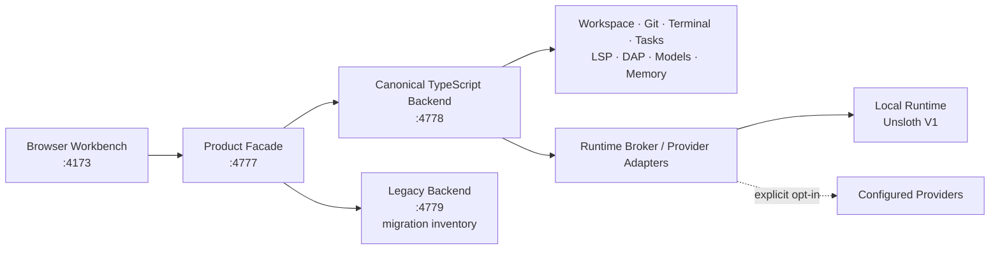

<div align="center">
  

# Covert Coder

**Sovereign AI software engineering. Local by default. Connected by choice.**

A governed development workbench for local and connected models, bounded context, tool execution, verification, provenance, and operator-controlled automation.

[](https://github.com/AnonymousNomad/covert-coder/actions/workflows/ci.yml?query=branch%3Acovert-production)
[](LICENSE)


[](SECURITY.md)

[Architecture](#architecture) · [Local Runtime](#local-runtime) · [Model Access](#model-access-and-routing) · [Verification](#verification-and-evidence) · [Quick Start](#quick-start) · [Engineering Preview](docs/ENGINEERING_PREVIEW.md) · [Security](SECURITY.md)

</div>

> [!IMPORTANT]
> **Covert Coder is an Engineering Preview.** It is being prepared for a controlled beta and is not yet a finished consumer release. Capability claims below distinguish implementation, availability, qualification, authority, and live proof. A route, screenshot, model file, mock, or successful compile is not treated as release evidence by itself.

## What Covert is

Covert Coder is a local-first AI development environment built around a simple rule:

> **The model is a worker. It is not the authority.**

The workbench is designed to keep model choice replaceable while the engineering control plane remains stable. Local models, BYOK providers, and supported connected runtimes can participate in the same governed workflow without giving any model raw control of the repository, machine, credentials, memory, or execution policy.

The current product direction is:

```text
DEVELOPER
  → RESIDENT ASSISTANT
  → CONTEXT CONTROL
  → WORKFLOW ENGINE + SKILL INTELLIGENCE
  → ORCHESTRATOR
  → MODEL ACCESS / ROUTING
  → EXECUTION AUTHORITY
  → WORKER MODELS + TOOLS
  → VERITAS / VERIFICATION
  → GHOST / PROVENANCE + MEMORY
  → RESIDENT
  → DEVELOPER
```

Planner, Coder, and Reviewer are logical worker roles behind one Resident surface. They may use one physical model, multiple local models, connected models, or a hybrid configuration. Role identity and physical model identity are deliberately separate.

## System principles

Covert is being engineered around five non-negotiable boundaries:

| Principle | Meaning |
| --- | --- |
| **Local-first** | Local inference and local tools do not require a cloud AI provider. |
| **Explicit egress** | Model downloads and configured online providers are separate, operator-controlled network actions. |
| **Governed execution** | Model output does not become machine authority. Privileged effects pass through typed services and authority checks. |
| **Evidence over confidence** | A model claiming success is not verification. Tests, runtime evidence, CI, and Veritas remain separate from model prose. |
| **No silent substitution** | Selected model, artifact, provider route, credential source, adapter, and observed response identity are tracked as distinct facts. |

## Architecture

### Product topology

The current development topology uses a browser workbench, a product façade, a canonical TypeScript backend, and a legacy backend retained as migration inventory.


```mermaid
flowchart LR
  UI["Browser Workbench<br/>:4173"] --> EDGE["Product Facade<br/>:4777"]
  EDGE --> TS["Canonical TypeScript Backend<br/>:4778"]
  EDGE --> LEGACY["Legacy Backend<br/>:4779<br/>migration inventory"]
  TS --> CAP["Workspace · Git · Terminal · Tasks<br/>LSP · DAP · Models · Memory"]
  TS --> BROKER["Runtime Broker / Provider Adapters"]
  BROKER --> LOCAL["Local Runtime<br/>Unsloth V1"]
  BROKER -. "explicit opt-in" .-> REMOTE["Configured Providers"]
```

New user-facing behavior is expected to travel through the façade and canonical backend. The legacy backend is not intended to become a second product architecture.

### Tool execution path

A tool call is not treated as permission.

```text
MODEL OUTPUT
  → TOOL PARSE
  → SCHEMA VALIDATION
  → CAPABILITY / POLICY CHECK
  → EXECUTION AUTHORITY
  → TOOL EXECUTION
  → RESULT
  → MODEL CONTINUATION
  → VERIFICATION / EVIDENCE
```

This separation is intentional. A model can propose a write without being allowed to perform it. A tool can execute successfully without proving the resulting software is correct. Verification is a separate concern.

## Local runtime

### Canonical V1 backend: Unsloth

Covert uses a runtime-broker boundary instead of coupling the workbench directly to one inference executable.

For V1, **Unsloth is the canonical local backend**. Direct llama.cpp remains an explicit reference/recovery path rather than a silent fallback.

The currently qualified local profile is intentionally narrow:

| Field | Qualified profile |
| --- | --- |
| OS | Windows 11 |
| Runtime | Unsloth 2026.9.11 |
| Backend | Unsloth-managed llama-server, Vulkan |
| GPU | NVIDIA GTX 1060 Mobile 6 GB |
| Model | LFM2.5-2.6B-Q4_K_M.gguf |
| Artifact size | 1,674,455,040 bytes |
| SHA-256 | `02a8b7e17487d326e46d68ce0ba24211e1b80a14c4cd0597fa73c1cd697f52ed` |
| Binding | `127.0.0.1:18888` |
| API protection | Bearer-authenticated loopback |

That exact profile passed:

- model discovery and exact artifact identity;
- authenticated and unauthenticated API behavior;
- non-stream inference;
- streaming;
- cancellation and recovery;
- invalid-request recovery;
- unload/reload;
- runtime interruption, restart, and reload;
- clean owned shutdown;
- one governed read-only tool-call path through Execution Authority.

A bounded stability run completed for a little over 30 minutes with **23 interval ticks, 46 host-resource samples, 19 requests, and zero failures**. The run included repeated inference, streaming, cancellation/recovery, unload/reload, and adapter-owned restart/reload behavior.

This is **profile-specific evidence**, not a claim that every GPU, OS, Unsloth version, quantization, or GGUF is qualified.

The engineering-preview evidence is maintained on the active convergence branch.

## Model lifecycle

Covert deliberately keeps model states separate.

```text
DISCOVERED
  → SELECTED
  → DOWNLOADING
  → VERIFIED
  → REGISTERED
  → ROLE_ASSIGNED
  → RUNTIME_QUALIFIED
  → READY
```

A file existing on disk is not READY.

A registered model is not automatically qualified.

A selected model is not proof that the same identity produced the response.

These distinctions are enforced because local AI systems become unreliable quickly when installation, availability, qualification, and execution identity are collapsed into one status flag.

## Model Access and routing

The canonical identity chain is:

```text
logical role
  → model identity
  → source / artifact identity
  → provider route
  → credential source
  → execution adapter
  → observed execution / response identity
```

This allows Planner, Coder, Reviewer, Resident, local runtime, BYOK providers, and supported subscription-backed adapters to remain separate concepts.

The goal is not to maximize the number of providers shown in a dropdown. The goal is to make the route that actually executed a task auditable.

### Current connected-provider boundary

Covert contains BYOK/provider foundations for multiple external providers, plus separate work for managed and official CLI-backed integrations.

Those paths are **opt-in** and are not equivalent to local operation.

Provider credentials are intended to remain daemon-side rather than in browser state or logs. Authentication, provider health, exact-model support, route availability, and execution qualification are tracked separately.

Connected-provider qualification is still active work and is not advertised as universally complete.

## Model Hub and hardware-aware acquisition

The daemon-side Model Hub foundation includes:

- Hugging Face model search;
- repository-file discovery;
- explicit GGUF download;
- resumable `.part` transfers;
- bounded retry;
- cancellation and cleanup;
- egress journaling before network activity;
- GGUF import and structure validation;
- hardware/model fit evaluation;
- runtime registration.

The first-run product flow being closed for beta is:

```text
device + workflow profile
  → model recommendation
  → explanation
  → operator approval
  → exact artifact resolution
  → download
  → integrity / format verification
  → registration
  → Planner / Coder / Reviewer assignment
  → runtime qualification
  → persisted readiness
```

The objective is to remove unnecessary manual setup without removing operator control.

## Resident, roles, context, and memory

### Resident

Resident is the persistent user-facing coordination surface. It is not intended to become a privileged tool executor that bypasses the rest of the architecture.

### Planner / Coder / Reviewer

Planner, Coder, and Reviewer are logical roles behind Resident. A single physical model may satisfy more than one role on constrained hardware. Separate models may be assigned where evidence and hardware justify it.

### Context Control

Context Control is responsible for bounded context composition. The design objective is to avoid indiscriminate repository dumping and instead provide the worker model with the information required for the current task.

### Skills and workflows

Skills and workflows provide procedural context and reusable operating knowledge. They are intended to make model behavior more repeatable without granting additional execution authority.

### Memory and provenance

Memory preserves useful project state. Ghost/provenance work is intended to retain the causal path between request, model, tool, file, verification, and outcome rather than reducing the development record to a chat transcript.

These systems remain at different maturity levels and are promoted independently.

## Workbench

The current workbench includes or exposes infrastructure for:

- Monaco-based editing;
- workspace and filesystem operations;
- project search;
- Git;
- governed terminal/process execution;
- tasks;
- TypeScript LSP;
- Python DAP;
- model/runtime state;
- Resident;
- provider and model access state;
- memory;
- verification and evidence surfaces.

Covert is being built as one development environment rather than a loose collection of external chat and model-launcher windows.

## Privacy and security model

Covert is **local-first**, not "network activity can never occur."

That distinction is intentional.

- Services bind to loopback by default.
- Local inference can operate without cloud AI credentials.
- Local tools can operate without a cloud AI provider.
- Model Hub search/download is an explicit network operation.
- Configured online providers are explicit network operations.
- When an online provider is enabled, that provider receives the context selected for that request.
- Provider credentials are intended to remain daemon-side.
- Model-generated actions remain untrusted proposals until the applicable authority boundary permits them.
- Imported models, plugins, dependencies, and generated artifacts are treated as untrusted inputs.

For a fully disconnected environment, required runtime/model assets must already be present locally or supplied through an approved offline import path.

Read [SECURITY.md](SECURITY.md) before using Covert with private source, sensitive workspaces, or external providers.

Security reports should use [GitHub private vulnerability reporting](https://github.com/AnonymousNomad/covert-coder/security/advisories/new).

## Verification and evidence

Covert separates:

```text
IMPLEMENTED
AVAILABLE
CONFIGURED
AUTHENTICATED
QUALIFIED
AUTHORIZED
EXECUTED
VERIFIED
READY
```

Those words are not synonyms.

The repository contains architecture tests, integration tests, acceptance checks, Veritas tooling, browser checks, evidence records, and exact-SHA CI.

The current active convergence checkpoint is:

| Item | Current verified state |
| --- | --- |
| Branch | `nightshift/production-convergence-20260926` |
| HEAD | `7391b98e1e0972dd3fe4365420fe15366b77b24c` |
| Exact-SHA CI | **SUCCESS** — AIDE CI `37160203378` |
| Previous full architecture gate | 983 total / 972 pass / 0 fail / 11 skip |
| Veritas at code checkpoint | 6/6 |
| Resident ownership UI fixture | 21/21 |

The current HEAD is a documentation/evidence-only child of the preceding green code checkpoint and also passed exact-SHA CI.

One earlier aggregate Windows E2E failure remains preserved in the evidence record. The same code passed after host resource headroom was restored, which supports host contention as the failure category; the exact low-level Windows scheduling/paging/I/O mechanism was not captured and is not claimed as proven.

That is deliberate. A later green result does not erase unexplained evidence.

## Branches and project status

| Branch | Purpose |
| --- | --- |
| `covert-production` | Public baseline and default repository branch |
| `nightshift/production-convergence-20260926` | Active engineering-preview convergence and release-spine work |
| feature branches | Isolated implementation, research, or product slices prior to integration |

The default branch is intentionally more conservative than the active convergence branch.

For the current beta state and open boundaries, see [docs/ENGINEERING_PREVIEW.md](docs/ENGINEERING_PREVIEW.md).

## Quick start

### Requirements

- Git
- Node.js **26.4.0** — current pinned CI reference runtime
- npm
- a compatible local runtime/model if local inference is required

The package may declare a broader Node range; that declaration is not equivalent to full certification on every Node version.

### Public baseline

```bash
git clone https://github.com/AnonymousNomad/covert-coder.git
cd covert-coder
git switch covert-production
npm ci
npm run doctor
npm start
```

Open:

```text
http://127.0.0.1:4173/
```

`npm run doctor` reports missing runtime binaries, model artifacts, and environment requirements. It does not silently enable a provider or create execution authority.

### Engineering preview

Experienced testers may evaluate the active convergence branch:

```bash
git fetch origin
git switch nightshift/production-convergence-20260926
npm ci
npm run doctor
npm start
```

Record the exact SHA you test.

## Beta status

Covert is entering controlled beta recruitment, not declaring V1 complete.

The remaining beta-entry work is primarily convergence between systems that already exist:

- first-run recommendation → exact artifact → acquisition → verification → registration → role assignment;
- clean Resident-model binding for a new user;
- real end-to-end local development task through the final integrated workbench;
- connected-provider execution qualification;
- restart/recovery and packaging acceptance on the final beta candidate;
- platform-specific gaps discovered by clean-machine testing.

The highest-value beta signal now comes from machines, models, and workflows that are not the development environment.

## Positioning

Covert is not intended to replace every local model server, chat interface, or AI coding product.

Projects such as llama.cpp, Ollama, LM Studio, Jan, Open WebUI, Continue, Codex, and other developer tools solve important parts of the stack.

Covert's boundary is different:

> **The runtime is infrastructure. The model is replaceable. The governed engineering system around the intelligence is the product.**

The project is focused on combining model choice with context control, role routing, explicit authority, verification, evidence, provenance, and recovery inside one operator-controlled development environment.

## Engineering doctrine

Development follows a verify-first operating rule:

```text
OBSERVE
→ PRESERVE
→ REPRODUCE
→ RESEARCH
→ ISOLATE
→ ROOT-CAUSE
→ REPAIR
→ REGRESSION
→ VERIFY
→ RECORD
→ CONTINUE
```

No silent fallback. No false READY. No converting a skip into a pass. No weakening a test simply to obtain green.

AI proposes. Evidence decides. The operator owns the final technical claim.

## Documentation

- [Architecture](docs/ARCHITECTURE.md)
- [Covert Coder North Star](docs/COVERT_CODER_NORTH_STAR.md)
- [Engineering Preview status](docs/ENGINEERING_PREVIEW.md)
- [Getting Started](docs/GETTING_STARTED.md)
- [Operations](docs/OPERATIONS.md)
- [Veritas / Harness](docs/VERITAS_HARNESS.md)
- [Release Roadmap](docs/RELEASE_ROADMAP.md)
- [Research Log](docs/RESEARCH_LOG.md)
- [Support](SUPPORT.md)
- [Contributing](CONTRIBUTING.md)
- [Security](SECURITY.md)

Historical files may use the **AIDE Sovereign Workbench** name. Covert Coder is the current public product identity.

## Contributing

Contributions should preserve operator control, reproducibility, and claim discipline.

Before substantial changes:

- read [CONTRIBUTING.md](CONTRIBUTING.md);
- keep credentials, private source, model weights, auth artifacts, and machine-specific secrets out of commits;
- add or update applicable tests;
- preserve authority/security boundaries;
- report skips and unsupported environments accurately;
- attach evidence to behavior-changing claims.

Typical verification commands include:

```bash
npm run check:arch
npm run build:frontend
npm run test:e2e
npm run veritas
```

Run the gates appropriate to the surface changed.

## Community and support

- [GitHub Issues](https://github.com/AnonymousNomad/covert-coder/issues) — bugs and engineering discussion
- [GitHub Discussions](https://github.com/AnonymousNomad/covert-coder/discussions) — broader project discussion
- [Security Policy](SECURITY.md)
- [Code of Conduct](CODE_OF_CONDUCT.md)
- [Support Guide](SUPPORT.md)

## License

Covert Coder is licensed under **Apache-2.0** unless a file or dependency states otherwise.

Third-party models, runtimes, libraries, and tools retain their own licenses and attribution requirements.

## Support the project

If Covert's local-first, evidence-driven direction is useful to you, you can star the repository, test engineering-preview checkpoints, report reproducible issues, contribute code or documentation, or support ongoing development through GitHub Sponsors.

[](https://github.com/sponsors/anonymousnomad)
