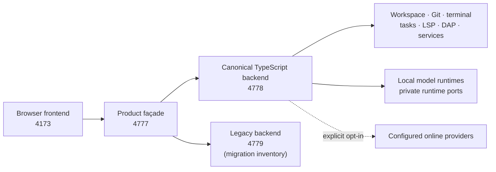

<div align="center">
  

# Covert Coder

**Vibe at the surface. Engineering underneath.**

Local-first AI development workbench for governed agent workflows, model choice, tool execution, verification, and evidence.

[](https://github.com/AnonymousNomad/covert-coder/actions/workflows/ci.yml?query=branch%3Acovert-production)
[](LICENSE)


[](SECURITY.md)

[Quick start](#quick-start) · [Architecture](#architecture) · [Project status](#project-status) · [Engineering Preview status](docs/ENGINEERING_PREVIEW.md) · [Documentation](#documentation) · [Contributing](CONTRIBUTING.md) · [Security](SECURITY.md)

</div>

> [!IMPORTANT]
> **Covert Coder is an Engineering Preview / pre-release project.** The default `covert-production` branch is the public baseline for cloning and evaluation. Features marked experimental, partial, or preview are not release-certified. Source presence, a route, a screenshot, or a successful mock does not by itself prove production readiness.

## What is Covert Coder?

Covert Coder is a sovereign AI development workbench built around one idea:

> **Models should not receive raw control of your machine, repository, context, or credentials simply because they can generate code.**

Covert places a governed control plane between the operator and the models/tools doing the work. The product is being built to coordinate context, workflows, model/provider selection, execution authority, verification, provenance, replay, and recovery around a real software project.

**Your models. Your machine. Your workflow.**  
Local by default. Connected by choice.

Covert Coder is the current public product identity. **AIDE Sovereign Workbench** is the project's engineering lineage and still appears in historical files, package metadata, and evidence records.

## Why Covert?

Modern AI development tools are increasingly capable, but model quality is only one part of the system. Covert focuses on the surrounding engineering discipline:

- **Local-first operation** — local models and tools remain first-class; cloud/provider use is explicit.
- **Governed execution** — privileged actions pass through typed routes and execution authority instead of raw model access.
- **Bounded context** — context, memory, workflows, and skills are selected deliberately rather than dumped into every request.
- **Model/provider choice** — local runtimes, BYOK routes, and provider integrations are treated as replaceable execution paths.
- **Evidence over claims** — tests, Veritas checks, CI, receipts, and provenance records are kept separate from model-generated prose.
- **Operator control** — generated changes remain proposals until the applicable approval and execution boundaries are satisfied.

## Project status

Covert is usable as a development checkout, but it is **not yet a finished consumer release or certified desktop installer**.

| Surface | Current status | Boundary |
| --- | --- | --- |
| Browser workbench, Monaco editor, workspace, search, chat | **Implemented** | Current typed browser/workbench source |
| Git, governed terminal, tasks, TypeScript LSP, Python DAP | **Implemented** | Typed route/service families |
| Resident Assistant | **Experimental** | Advisory/coordination surface; not an authority bypass |
| Context Control | **Partial** | Canonical chat composition is bounded; alternate surfaces remain phase-gated |
| Workflow Engine + Skill Intelligence | **Experimental** | Workflow and skill metadata exist; promotion remains governed |
| Orchestrator | **Available** | Coordinates task/model/tool paths through typed services |
| Execution Authority | **Available** | Mediates privileged execution and writes |
| Local model/runtime support | **Available / hardware-dependent** | Requires compatible runtime/model artifacts |
| BYOK and provider routing | **Partial / opt-in** | Network/provider use remains explicit and phase-gated |
| Model Hub / Hugging Face integration | **Partial / opt-in** | Search/import paths exist; downloads are explicit network operations |
| Veritas / evidence gates | **Implemented as tooling** | Verification does not itself grant execution permission |
| Ghost Code / provenance / replay | **Partial** | Claims are limited to recorded evidence |
| Memory / Helix | **Experimental** | Scoped persistence exists; product promotion is still gated |
| Plugins / workbenches | **Experimental** | Capability and trust boundaries remain explicit |
| Desktop packaging / bounded desktop control | **Experimental** | Historical builds do not certify the current Covert cockpit |
| Clean-machine installer / upgrade / uninstall acceptance | **Not release-certified** | Still part of the release spine |

The status language above is intentionally conservative.

## Architecture

The intended governed product loop is:

```text
USER
  → RESIDENT ASSISTANT
  → CONTEXT CONTROL
  → WORKFLOW ENGINE + SKILL INTELLIGENCE
  → ORCHESTRATOR
  → EXECUTION AUTHORITY
  → RESOURCE ADMISSION
  → HARNESS
  → WORKER MODELS / TOOLS
  → VERITAS
  → GHOST CODE / PROVENANCE
  → MISSION RECEIPT + MEMORY
  → RESIDENT
  → USER
```

The current development topology uses a browser frontend, a single product façade, a canonical TypeScript backend, and a legacy backend retained only as migration inventory:


```mermaid
flowchart LR
  UI["Browser frontend<br/>4173"] --> EDGE["Product façade<br/>4777"]
  EDGE --> TS["Canonical TypeScript backend<br/>4778"]
  EDGE --> LEGACY["Legacy backend<br/>4779<br/>(migration inventory)"]
  TS --> CAP["Workspace · Git · terminal<br/>tasks · LSP · DAP · services"]
  TS --> LOCAL["Local model runtimes<br/>private runtime ports"]
  TS -. "explicit opt-in" .-> CLOUD["Configured online providers"]
```

New user-facing behavior is expected to travel through the façade. The legacy backend is not a second product architecture.

See [docs/ARCHITECTURE.md](docs/ARCHITECTURE.md) for the canonical route ownership and migration details.

## Quick start

### Requirements

- Git
- **Node.js 26.4.0** — the current pinned CI reference runtime
- npm
- A supported local model/runtime if you want local inference

The package currently declares `node >=20`; that declaration is **not** a claim that the full current verification path is certified on every Node 20+ release.

### Clone the public baseline

```bash
git clone https://github.com/AnonymousNomad/covert-coder.git
cd covert-coder
git switch covert-production
npm ci
npm run doctor
npm start
```

Then open:

```text
http://127.0.0.1:4173/
```

`npm run doctor` reports missing runtimes, model artifacts, and related environment requirements. It does not download private assets, create execution authority, or silently enable a cloud provider.

> [!NOTE]
> Current testing is source-based. A clean-machine installer is part of the release roadmap and is not yet advertised as finished.

## Engineering preview

The current public status snapshot is tracked in [docs/ENGINEERING_PREVIEW.md](docs/ENGINEERING_PREVIEW.md).

The active convergence work happens on:

```text
nightshift/production-convergence-20260926
```

This branch contains newer Model Access, provider lifecycle, evidence, and release-spine work than the public baseline. It moves quickly and is intended for experienced testers who are comfortable reading CI/evidence and reporting regressions.

```bash
git fetch origin
git switch nightshift/production-convergence-20260926
npm ci
npm run doctor
npm start
```

> [!WARNING]
> The engineering preview is **not a release branch**. Check the branch's latest GitHub Actions result before evaluating a checkpoint. A temporarily red checkpoint is treated as a defect to investigate, not as something to hide or relabel as green.

## Verification

For normal development changes:

```bash
npm run check:arch
npm run build:frontend
npm run test:e2e
```

The repository also contains broader test, acceptance, harness, desktop, and Veritas commands. Run the checks appropriate to the surface you changed.

`check:arch` includes:

- Node TypeScript
- browser TypeScript
- ESLint
- bounded architecture tests

Hardware- or artifact-dependent checks may be skipped when their required environment is absent. A skip is not a pass.

For a fuller contributor gate, see [CONTRIBUTING.md](CONTRIBUTING.md).

## Evidence model

Covert deliberately separates **implementation**, **availability**, **qualification**, **authority**, and **verification**.

Examples:

- a stored credential does not prove provider authentication;
- provider health does not prove support for an exact model route;
- an installed model artifact does not prove qualification;
- a successful fixture does not prove live provider execution;
- a successful compile does not prove runtime behavior;
- Veritas evidence does not grant execution authority.

Evidence lives across typed contracts, tests, CI, Veritas reports, dated evidence records, and replay/provenance surfaces.

Relevant locations include:

- `common/` — shared typed contracts and generated API descriptions
- `tests/` — unit, integration, architecture, and acceptance coverage
- `harness/` — model-independent verification and operating gates
- `docs/evidence/` — public evidence records where appropriate
- `capsules/` — portable evidence/runtime metadata
- `benchmarks/` — benchmark definitions and published results when available

## Privacy and security

Covert is local-first, not "cloud can never happen."

- Services bind to loopback by default.
- Local models and local tools can operate without cloud credentials.
- Model Hub searches/downloads and configured online providers are explicit network operations.
- When an online provider is enabled, the provider receives the content selected for that request.
- Provider credentials are intended to remain daemon-side rather than browser state or logs.
- Imported models, plugins, dependencies, and model-generated output are treated as untrusted inputs.
- Privileged writes and tool actions are expected to pass through the applicable authority boundary.

Read [SECURITY.md](SECURITY.md) before using Covert with private source or external providers.

Security issues should be reported through [GitHub private vulnerability reporting](https://github.com/AnonymousNomad/covert-coder/security/advisories/new), not through a public issue.

## Models and network choices

Model weights are not stored in this repository.

Public model-pack metadata lives in [models/PACKS.md](models/PACKS.md). Local imports and configured provider connections are separate from network model search/download operations.

The project is actively converging its model identity and execution path around explicit distinctions between:

```text
model identity
→ source / artifact identity
→ provider route
→ credential source
→ execution adapter
```

Those boundaries exist to prevent "configured" from being mistaken for "verified and executable."

## Testing Covert

Technical testers are welcome.

For the cleanest signal:

1. Start with the default `covert-production` branch unless you specifically want the engineering preview.
2. Use Node.js 26.4.0.
3. Run `npm ci` and `npm run doctor`.
4. Record the exact branch and commit SHA you tested.
5. Include the failing command, operating system, and relevant non-sensitive logs in bug reports.
6. Do **not** post credentials, private source, model weights, auth artifacts, or private data.

Useful feedback includes:

- setup/clone failures;
- broken first-run behavior;
- browser/workbench usability;
- model/runtime discovery problems;
- Git/terminal/LSP/DAP regressions;
- cancellation or cleanup failures;
- misleading status/readiness labels;
- documentation gaps;
- accessibility or responsive-layout issues.

Use [GitHub Issues](https://github.com/AnonymousNomad/covert-coder/issues) for normal bugs and feature discussion. Use private vulnerability reporting for security findings.

## Current release focus

The active release spine is focused on closing, with evidence:

- Model Access and provider lifecycle correctness;
- real governed provider/model execution;
- Mission Receipt and provenance;
- restart/recovery;
- Resident end-to-end orchestration;
- first-user/browser acceptance;
- local-model acquisition and integrity;
- installer/package/signing/SBOM/license gates;
- clean-user and clean-machine install;
- upgrade/uninstall/state preservation;
- adaptive onboarding;
- final release evidence.

Cosmetic polish and public launch work remain secondary to these gates.

See [docs/RELEASE_ROADMAP.md](docs/RELEASE_ROADMAP.md) for the public release roadmap.

## Documentation

Start with [docs/README.md](docs/README.md).

- [Getting started](docs/GETTING_STARTED.md)
- [Architecture](docs/ARCHITECTURE.md)
- [Covert Coder north star](docs/COVERT_CODER_NORTH_STAR.md)
- [Operations](docs/OPERATIONS.md)
- [Veritas and Harness](docs/VERITAS_HARNESS.md)
- [Release roadmap](docs/RELEASE_ROADMAP.md)
- [Research log](docs/RESEARCH_LOG.md)
- [Engineering Preview status](docs/ENGINEERING_PREVIEW.md)
- [Public site brief](docs/PUBLIC_SITE_BRIEF.md)
- [Support](SUPPORT.md)

Historical documents may use the AIDE name or contain time-bound paths/status. Verify historical records against the current source and canonical documentation before treating them as product truth.

## Contributing

Contributions should preserve user control, reproducibility, and honest capability reporting.

Before submitting substantial changes:

- read [CONTRIBUTING.md](CONTRIBUTING.md);
- keep credentials, model weights, private data, and machine-specific secrets out of commits;
- add or update the applicable tests;
- update contracts/manifests/documentation when behavior changes;
- report limitations and skips instead of hiding them.

The current contributor gate includes:

```bash
npm test
npm run check
npm run veritas
```

Desktop work has additional preparation/build requirements described in the contributing guide.

## Community standards

This repository includes:

- [Security Policy](SECURITY.md)
- [Contribution Guide](CONTRIBUTING.md)
- [Code of Conduct](CODE_OF_CONDUCT.md)
- [Support Guide](SUPPORT.md)
- [Apache-2.0 License](LICENSE)

These files define the project's contribution, support, disclosure, and conduct expectations.

## License

Covert Coder is licensed under **Apache-2.0** unless a file or dependency states otherwise.

Third-party models, runtimes, libraries, and tools retain their own licenses and attribution requirements.

## Support the project

If Covert's local-first, evidence-driven direction is useful to you, you can follow the repository, test pre-production checkpoints, report reproducible issues, contribute code/documentation, or sponsor ongoing development.

[](https://github.com/sponsors/anonymousnomad)