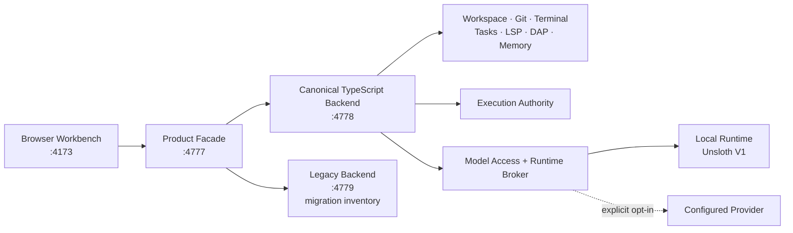

<div align="center">
  

# Covert Coder

**Sovereign AI software engineering. Local by default. Connected by choice.**

A governed AI development workbench for local and connected models, bounded context, typed tool execution, verification, evidence, provenance, and operator-controlled automation.

[](https://github.com/AnonymousNomad/covert-coder/actions/workflows/ci.yml?query=branch%3Acovert-production)
[](LICENSE)


[](SECURITY.md)

[Architecture](#system-architecture) · [Local runtime](#local-runtime) · [Privacy](#privacy-security-and-egress) · [Verification](#verification-and-evidence) · [Quick start](#quick-start) · [Engineering Preview](docs/ENGINEERING_PREVIEW.md) · [Contributing](CONTRIBUTING.md)

</div>

> [!IMPORTANT]
> **Covert Coder is an Engineering Preview entering controlled beta recruitment.** The public `covert-production` branch remains the conservative evaluation baseline. Active release-spine work is developed and qualified separately before promotion. A route, screenshot, model file, mock, or green rerun is not treated as production proof by itself.

## Overview

Covert Coder is a local-first AI software-engineering environment built around one architectural rule:

> **Models are replaceable workers. They are not the authority.**

The workbench is designed to coordinate the complete engineering transaction around intelligence: context selection, workflow, model identity, provider/runtime routing, tool execution, authorization, verification, provenance, replay, recovery, and persistent project state.

The goal is not another model-specific coding client. It is an operator-controlled development system that can use local inference, configured providers, or hybrid role assignment without moving trust into the model itself.

**Your models. Your machine. Your workflow.**

Covert Coder is the current public product identity. **AIDE Sovereign Workbench** is historical engineering lineage and still appears in older evidence, package metadata, and migration records.

## Design principles

| Principle | Engineering meaning |
| --- | --- |
| **Local first** | Local models and local tools remain first-class. Online model search and provider execution are explicit egress choices. |
| **Operator authority** | A model may propose an action; it does not gain raw machine authority by generating a tool call. |
| **Typed execution** | Privileged operations flow through bounded services, contracts, capability checks, and execution authority. |
| **Replaceable intelligence** | Logical roles are separated from physical model/provider identity. |
| **Truthful state** | Discovered, downloaded, verified, registered, running, qualified, and ready are not interchangeable states. |
| **No silent fallback** | Runtime/provider substitution must be explicit and observable. |
| **Evidence over confidence** | Model prose, compilation, runtime execution, verification, and release acceptance remain separate claims. |
| **Failure preservation** | A later green rerun does not erase an unexplained earlier red. |

## System architecture

The governed product loop is designed around one Resident surface with specialized worker roles behind it:

```text
USER
  → RESIDENT ASSISTANT
  → CONTEXT CONTROL
  → WORKFLOW ENGINE + SKILL INTELLIGENCE
  → ORCHESTRATOR
  → MODEL ACCESS / ROLE ROUTING
  → EXECUTION AUTHORITY
  → RESOURCE ADMISSION
  → WORKER MODELS + TOOLS
  → VERITAS / VERIFICATION
  → GHOST / PROVENANCE
  → MISSION RECEIPT + MEMORY
  → RESIDENT
  → USER
```

### Resident and worker roles

Resident is the continuity and interaction surface.

Planner, Coder, and Reviewer are logical roles behind Resident. They are not required to be three separate chats or three simultaneously loaded physical models.

A constrained machine may assign one model to multiple roles. A larger system may assign distinct models. Hybrid configurations can eventually use local and connected models for different roles while preserving the same authority and verification boundaries.

### Runtime topology

The application topology separates browser UX, product routing, canonical backend ownership, and model runtimes:


```mermaid
flowchart LR
  UI["Browser Workbench<br/>:4173"] --> EDGE["Product Facade<br/>:4777"]
  EDGE --> TS["Canonical TypeScript Backend<br/>:4778"]
  EDGE --> LEGACY["Legacy Backend<br/>:4779<br/>migration inventory"]
  TS --> CAP["Workspace · Git · Terminal<br/>Tasks · LSP · DAP · Memory"]
  TS --> AUTH["Execution Authority"]
  TS --> MODEL["Model Access + Runtime Broker"]
  MODEL --> LOCAL["Local Runtime<br/>Unsloth V1"]
  MODEL -. "explicit opt-in" .-> CLOUD["Configured Provider"]
```

New user-facing behavior is expected to travel through the product facade and canonical backend. The legacy backend exists as migration inventory, not as a second product architecture.

See [docs/ARCHITECTURE.md](docs/ARCHITECTURE.md) for route ownership and migration details.

## Model access and routing

Covert treats model selection as a chain of identities rather than a single string in a dropdown:

```text
logical role
→ model identity
→ source / artifact identity
→ provider route
→ credential source
→ execution adapter
→ observed response identity
```

This prevents configuration from being mistaken for execution truth.

Selecting a model does not prove that model answered. A stored credential does not prove provider authentication. A provider health check does not prove an exact model route. A downloaded artifact does not prove runtime qualification.

Those states are intentionally separate.

## Tool execution and authority

A model-generated tool request is untrusted input until it crosses the applicable control boundaries.

```text
model proposes tool
→ parse
→ schema validation
→ capability / policy evaluation
→ Execution Authority
→ operator policy / approval where required
→ execution
→ result
→ model continuation
→ verification
→ evidence
```

This separates four different questions:

1. Can the model describe the action?
2. Is the action structurally valid?
3. Is the action permitted?
4. Did the resulting work actually satisfy the engineering requirement?

Covert does not collapse those into a single “agent succeeded” state.

## Local runtime

### Canonical V1 backend

The active engineering preview has qualified **Unsloth** as the canonical V1 local runtime backend through the Runtime Broker boundary.

Direct llama.cpp remains an explicit reference/recovery path. It is not intended to become an invisible fallback when the primary runtime is unavailable.

The frozen qualification profile is deliberately narrow:

| Field | Qualified profile |
| --- | --- |
| OS | Windows 11 |
| Runtime | Unsloth 2026.9.11 |
| Backend | Vulkan through the Unsloth-managed llama-server path |
| GPU | NVIDIA GTX 1060 Mobile 6 GB |
| Model | LFM2.5-2.6B-Q4_K_M.gguf |
| Artifact size | 1,674,455,040 bytes |
| SHA-256 | `02a8b7e17487d326e46d68ce0ba24211e1b80a14c4cd0597fa73c1cd697f52ed` |
| Binding | `127.0.0.1:18888` |
| API protection | Bearer-authenticated loopback |

That exact profile passed bounded live qualification for:

- model discovery and exact artifact identity;
- authenticated and unauthenticated API behavior;
- non-stream inference;
- streaming;
- cancellation and recovery;
- invalid-request recovery;
- unload/reload;
- runtime interruption, restart, and reload;
- clean owned shutdown;
- one governed read-only tool path through Execution Authority.

The same profile completed a bounded 30-minute stability run with **23 interval ticks, 46 host-resource samples, 19 requests, and zero failures**. The run included repeated inference, streaming, cancellation/recovery, unload/reload, and adapter-owned restart/reload behavior.

> [!NOTE]
> This is **profile-specific qualification**, not a claim that every operating system, GPU, model, quantization, or Unsloth release is certified.

The detailed runtime evidence is maintained on the active convergence branch:
[Unsloth Runtime V1 closeout](https://github.com/AnonymousNomad/covert-coder/blob/nightshift/production-convergence-20260926/docs/design/local-runtime-lab/UNSLOTH-RUNTIME-V1-CLOSEOUT.md).

## Model lifecycle

Covert keeps model lifecycle states explicit:

```text
DISCOVERED
→ SELECTED
→ DOWNLOADING
→ VERIFIED
→ REGISTERED
→ ROLE_ASSIGNED
→ RUNTIME_QUALIFIED
→ READY
```

The product should not report READY because a filename exists, a manifest contains an entry, or a catalog lookup succeeded.

A registered model is not automatically qualified.

A selected model is not proof that the same identity produced the response.

### Model Hub and acquisition

The project includes daemon-side infrastructure for:

- Hugging Face search and repository-file discovery;
- explicit model downloads;
- resumable partial transfers;
- bounded retry;
- cancellation and cleanup;
- egress journaling before network activity;
- GGUF import and validation;
- hardware/model fit evaluation;
- runtime registration;
- model-role assignment foundations.

The active first-run work is converging those pieces into one transaction:

```text
hardware + workflow
→ recommendation
→ operator approval
→ exact artifact
→ download
→ integrity / format validation
→ registration
→ role assignment
→ runtime qualification
→ persisted readiness
```

The objective is to remove unnecessary manual setup without removing operator control.

## Context, workflow, memory, and provenance

Covert is not designed to solve context management by sending the entire repository to every model.

The system separates:

- **Context Control** — bounded project context selection;
- **Workflow Engine** — durable engineering task structure;
- **Skill Intelligence** — procedural capability and methodology;
- **Memory** — scoped retained project/user state;
- **Ghost / provenance** — evidence and replay relationships between requests, actions, artifacts, and outcomes.

These systems are at different maturity levels. Public capability claims remain bounded by current evidence rather than architecture diagrams.

## Workbench

The current workbench includes or exposes infrastructure for:

- Monaco-based editing;
- workspace and filesystem operations;
- project search;
- Git;
- governed terminal/process execution;
- tasks;
- TypeScript LSP;
- Python DAP;
- model/runtime state;
- Resident;
- provider and model access state;
- memory;
- verification and evidence surfaces.

Covert is being built as one development environment rather than a loose collection of external chat and model-launcher windows.

## Privacy, security, and egress

Covert is **local-first**, not “network activity can never occur.”

The boundary is explicit:

- services bind to loopback by default;
- local models and local tools can operate without cloud-provider credentials;
- provider credentials are intended to remain daemon-side rather than browser state or logs;
- Model Hub search/download is an explicit network operation;
- configured online providers are explicit network operations;
- when an online provider is enabled, that provider receives the context selected for that request;
- imported models, plugins, dependencies, provider responses, and model-generated output are treated as untrusted inputs;
- privileged writes and tool actions remain subject to the applicable authority boundary.

Local inference is not dependent on a remote inference provider once the required local runtime and model artifacts are present.

For a fully disconnected environment, required runtime/model assets must already be present locally or supplied through an approved offline import path.

Read [SECURITY.md](SECURITY.md) before using Covert with private source or external providers.

Security vulnerabilities should be reported through [GitHub private vulnerability reporting](https://github.com/AnonymousNomad/covert-coder/security/advisories/new), not a public issue.

## Current capability status

The public baseline intentionally uses conservative labels.

| Surface | Status | Boundary |
| --- | --- | --- |
| Browser workbench, Monaco editor, workspace, search, chat | **Implemented** | Public baseline |
| Git, terminal, tasks, TypeScript LSP, Python DAP | **Implemented** | Typed service/route families |
| Resident Assistant | **Experimental** | Coordination surface; not an authority bypass |
| Context Control | **Partial** | Canonical bounded context exists; convergence continues |
| Workflow Engine + Skill Intelligence | **Experimental** | Metadata and execution foundations exist |
| Orchestrator | **Available** | Coordinates model/tool paths through typed services |
| Execution Authority | **Available** | Mediates privileged execution and writes |
| Runtime Broker | **Available** | Local-runtime ownership is abstracted from product workflow |
| Unsloth V1 runtime | **Qualified for frozen profile** | Exact profile only; not universal hardware/OS support |
| Model Hub / Hugging Face integration | **Partial / opt-in** | Search/import/download infrastructure; network use explicit |
| BYOK/provider routing | **Partial / opt-in** | Connected execution remains separately qualified |
| Veritas / evidence gates | **Implemented as tooling** | Verification does not grant execution permission |
| Ghost / provenance / replay | **Partial** | Public claims remain evidence-bounded |
| Memory / Helix | **Experimental** | Scoped persistence/retrieval is still being productized |
| Desktop packaging / bounded desktop control | **Experimental** | Historical packages do not certify the current cockpit |
| Clean-user installer / upgrade / uninstall | **Not release-certified** | Release-spine gate |

For the active status snapshot, see [docs/ENGINEERING_PREVIEW.md](docs/ENGINEERING_PREVIEW.md).

## Verification and evidence

Covert deliberately separates:

```text
IMPLEMENTED
AVAILABLE
CONFIGURED
AUTHENTICATED
QUALIFIED
AUTHORIZED
EXECUTED
VERIFIED
READY
```

Those words are not synonyms.

The repository contains architecture tests, integration tests, acceptance checks, browser checks, Veritas tooling, evidence records, and exact-SHA CI.

### Current verified convergence checkpoint

| Item | Current verified state |
| --- | --- |
| Branch | `nightshift/production-convergence-20260926` |
| HEAD | `7391b98e1e0972dd3fe4365420fe15366b77b24c` |
| Exact-SHA CI | **SUCCESS** — AIDE CI `37160203378` |
| Preceding full architecture gate | 983 total / 972 pass / 0 fail / 11 skip |
| Veritas at code checkpoint | 6/6 |
| Resident ownership UI fixture | 21/21 |
| Hook-environment focused regression | 14/14 |

The current HEAD is a documentation/evidence-only child of the preceding green code checkpoint and also passed exact-SHA CI.

One earlier aggregate Windows E2E failure remains preserved. The same code passed after host resource headroom was restored, which supports host contention as the failure category. The exact lower-level Windows scheduling/paging/I/O mechanism was not captured and is not claimed as proven.

A later green does not erase unexplained evidence.

### Evidence law

Covert separates:

**implementation**
≠ **availability**
≠ **qualification**
≠ **authority**
≠ **verification**
≠ **release acceptance**

Relevant evidence surfaces include:

- `common/` — shared contracts and generated API definitions;
- `tests/` — unit, integration, architecture, and acceptance coverage;
- `harness/` — model-independent verification and operating gates;
- `docs/evidence/` — public evidence records where appropriate;
- `capsules/` — portable runtime/evidence metadata;
- `benchmarks/` — benchmark definitions and published results.

## Branches and project status

| Branch | Purpose |
| --- | --- |
| `covert-production` | Public baseline and default repository branch |
| `nightshift/production-convergence-20260926` | Active Engineering Preview convergence and release-spine work |
| feature branches | Isolated implementation, research, or product slices before integration |

The default branch is intentionally more conservative than the active convergence branch.

## Quick start

### Requirements

- Git
- **Node.js 26.4.0** — current pinned CI reference runtime
- npm
- a compatible local model/runtime if local inference is required

The package currently declares Node >=20. That declaration is not a certification that every Node 20+ release passes the complete verification path.

### Public baseline

```bash
git clone https://github.com/AnonymousNomad/covert-coder.git
cd covert-coder
git switch covert-production
npm ci
npm run doctor
npm start
```

Open:

```text
http://127.0.0.1:4173/
```

`npm run doctor` reports missing runtime binaries, model artifacts, and environment requirements. It does not silently download private assets, create execution authority, or enable an online provider.

### Engineering Preview

Experienced testers can inspect the active convergence lane:

```bash
git fetch origin
git switch nightshift/production-convergence-20260926
npm ci
npm run doctor
npm start
```

Record the exact SHA tested.

> [!WARNING]
> The convergence branch is not a release branch. Evaluate checkpoints by **exact commit SHA and exact-SHA CI**, not by branch name alone.

## Beta status

Covert is entering controlled beta recruitment, not declaring V1 complete.

The remaining beta-entry work is primarily convergence between systems that already exist:

- first-run hardware/workflow profiling;
- recommendation → exact artifact → acquisition → integrity → registration → role assignment;
- clean Resident-model binding;
- governed local inference through the final first-user product path;
- connected-provider qualification;
- restart/recovery on the final beta candidate;
- clean-machine packaging/installer acceptance;
- upgrade/uninstall/state preservation;
- platform-specific gaps exposed by clean-machine testing.

The highest-value beta signal now comes from machines, models, and workflows that are not the development environment.

## Positioning

Covert is not intended to replace every local model server, chat interface, or AI coding product.

Projects such as llama.cpp, Ollama, LM Studio, Jan, Open WebUI, Continue, Codex, and other developer tools solve important parts of the stack.

Covert's boundary is different:

> **The runtime is infrastructure. The model is replaceable. The governed engineering system around the intelligence is the product.**

The project focuses on combining model choice with context control, role routing, explicit authority, verification, evidence, provenance, and recovery inside one operator-controlled development environment.

## Development doctrine

The project follows an evidence-first operating discipline internally referred to as **The Developer’s Way**:

```text
OBSERVE
→ PRESERVE
→ REPRODUCE
→ RESEARCH
→ ISOLATE
→ ROOT-CAUSE
→ REPAIR
→ REGRESSION
→ VERIFY
→ PROVE
→ RECORD
→ CONTINUE
```

Practical rules:

- do not weaken a test merely to obtain green;
- do not increase a timeout simply because a timeout occurred;
- do not convert UNKNOWN into READY;
- do not hide degraded state;
- do not silently fall back to another model/provider;
- do not treat a rerun as root cause;
- do not let documentation outrun evidence.

**AI proposes. Evidence decides. The operator owns the final technical claim.**

## Verification commands

Typical development checks include:

```bash
npm run check:arch
npm run build:frontend
npm run test:e2e
npm run veritas
```

The repository also contains focused acceptance, runtime, browser, integration, and desktop qualification commands.

Hardware- or artifact-dependent tests may skip when required assets are absent. A skip remains a skip.

## Documentation

- [Getting started](docs/GETTING_STARTED.md)
- [Architecture](docs/ARCHITECTURE.md)
- [Covert Coder North Star](docs/COVERT_CODER_NORTH_STAR.md)
- [Engineering Preview](docs/ENGINEERING_PREVIEW.md)
- [Operations](docs/OPERATIONS.md)
- [Veritas and Harness](docs/VERITAS_HARNESS.md)
- [Release roadmap](docs/RELEASE_ROADMAP.md)
- [Research log](docs/RESEARCH_LOG.md)
- [Support](SUPPORT.md)

Historical documents may use the AIDE name or contain time-bound paths/status. Historical evidence should be evaluated against its recorded commit, environment, and scope.

## Contributing

Contributions should preserve operator control, reproducibility, explicit authority boundaries, and honest capability reporting.

Before substantial changes:

- read [CONTRIBUTING.md](CONTRIBUTING.md);
- keep credentials, private source, model weights, auth artifacts, and machine-specific secrets out of commits;
- add or update applicable tests;
- update contracts and documentation when behavior changes;
- preserve skips, degraded states, and unsupported conditions accurately.

See also:

- [Security Policy](SECURITY.md)
- [Code of Conduct](CODE_OF_CONDUCT.md)
- [Support Guide](SUPPORT.md)
- [Apache-2.0 License](LICENSE)

## Community

- [GitHub Issues](https://github.com/AnonymousNomad/covert-coder/issues) — bugs and engineering discussion
- [GitHub Discussions](https://github.com/AnonymousNomad/covert-coder/discussions) — broader project discussion
- [Private vulnerability reporting](https://github.com/AnonymousNomad/covert-coder/security/advisories/new) — security issues

## License

Covert Coder is licensed under **Apache-2.0** unless a file or dependency states otherwise.

Third-party models, runtimes, libraries, and tools retain their own licenses and attribution requirements.

## Support the project

Covert is being developed in public. Useful participation includes reproducible bug reports, hardware/runtime testing, documentation, code contributions, and sponsorship.

[](https://github.com/sponsors/anonymousnomad)
