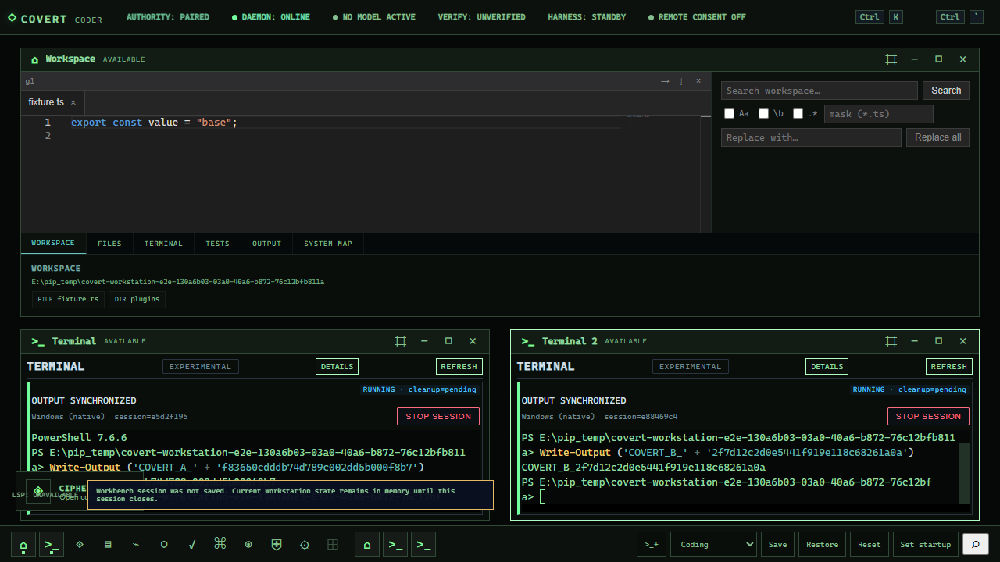
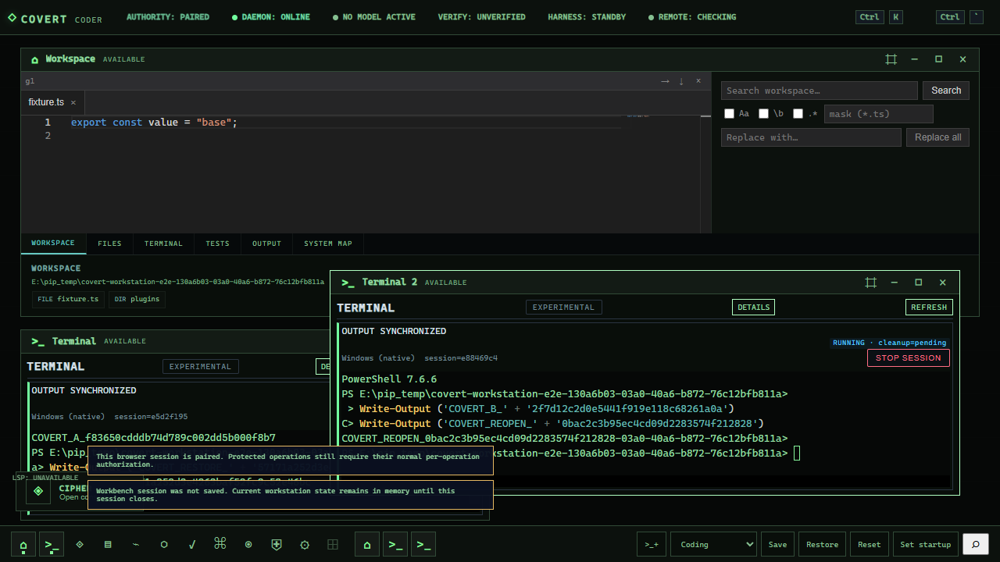

# Covert production workstation checkpoint
Session: 2026-10-06 to 2026-10-07 UTC. This supersedes the earlier host-offline preparation checkpoint.

The actual production shell now mounts the existing editor and two independent real terminal windows. Opaque compact phosphor chrome, bounded window instances, canonical terminal reattachment and replay, usable active-terminal surfaces and failure recovery are implemented. This is a bounded production slice, not a claim that the whole workstation or packaged security acceptance is complete.

## Reconciled source and integration

| Tree | Exact truth | Disposition |
|---|---|---|
| E:\covert-sovereign-workstation-shell | feat/covert-sovereign-workstation-shell; 12b999d329b59fd7dd480504ce84670b0de521f5; no upstream; 18 modified + 4 untracked; 763 insertions / 95 deletions | Original untouched. Complete 74,128-byte dirty patch and untracked sources inspected and preserved. |
| E:\covert-nightshift-integration | nightshift/production-convergence-20260926; cfaad716a01af06dfe61dcfb3d1acd7dea9b4b2c | Shell is 7 ahead / 0 behind. No shared convergence mutation. |
| E:\covert-desktop-dogfood-20261006 | codex/desktop-dogfood-integrated-20261006; da320b96fc9ab2ec4da7d0c24150d24ce90d2c17; clean | Direct descendant of shell HEAD: merge-base 12b999d..., shell vs packaging 0 / 6. Six packaging commits do not overlap Luna's 22 dirty paths. Original retained untouched. |
| E:\covert-workstation-integration-saul-20261006 | feat/workstation-integration-saul-20261006; application acceptance at 56c977b46a3a66df4a657d5bbd0aeb1f6618c1aa | Chosen isolated integration starts from packaging descendant, then preserves Luna's complete dirty snapshot before bounded changes. |

Forty original source files were rechecked by byte hash, together with the original shell HEAD/dirty status and clean packaging HEAD. All remained unchanged. Dependency access uses a junction to the existing installed dependencies; no dependency installation was performed. No reset, clean, stash, foreign process termination, forced push or shared-branch merge.

## Luna and foundation disposition

| Component | Classification | Adoption |
|---|---|---|
| ASK/PLAN/ACT and AgentLoop | KEEP / ADAPT | Existing shared composer/task events preserved; repair re-ask and timeline races in place. Native editor/AgentLoop dirty-draft regression passes. |
| Terminal ownership / reattachment / scrollback | KEEP / ADAPT | Canonical service and Authority decisions retained. Distinct window controllers rehost sessions; owner-checked replay repairs adopted at the service boundary. |
| Existing EditorHost | REHOST / KEEP | Editor implementation unchanged. Existing file/project/session owners retained. |
| Startup readiness and packaging | KEEP | Preserve Luna startup work and inherit the six packaging commits. No packaging-owned source overwritten. |
| Drop-intent foundation | ADAPT; activation pending | Adopt through canonical operation/Authority and Context Control seams. No alternate executor. |
| Environment-profile foundation | ADAPT; activation pending | Presentation/preferences remain distinct from installation, grant changes, execution, download and model admission. |
| Shared Buddy presence | ADAPT; activation pending | Scout/Rook/Mutt/Tinker share one presentation engine; no new Resident identity or cosmetic operational truth. |
| Optional-media teardown | ADAPT; activation pending | Actual device/route generation owners must be connected and qualified before activation. Continuous capture/listening remains off. |

No competing shell was built from stale source. The unmounted foundation work is not counted as production Buddy, voice, vision, profile or governed drop support.

## Actual production changes

- Compact opaque black/phosphor tokens and chrome; rectangular controls, monospace interface, no glass or animated decorative telemetry.
- Default coding environment: existing editor above two independent terminal frames. Existing saved layouts retain their bounds and identities.
- Application kind is separate from window instance identity. Terminal is multi-instance, bounded to eight display instances; singleton applications retain their behavior.
- Window focus, resize, snap, minimize, close, reopen and layout restoration operate by display instance. These identities are not Authority principals or process ownership.
- CockpitShell mounts distinct lazy terminal controllers and retains a canonical admitted session when a frame closes. Full UI disposal unsubscribes/tears down view resources without implicitly terminating service-owned sessions.
- Canonical resume confirmation gates stdin/resize/stop. Display bindings cannot silently attach one session to two frames.
- Container ResizeObserver and coalesced fitting resize the actual xterm/PTY. Frontend scrollback is bounded; hidden/disconnected task-history polling is suppressed.
- HTTP owner-checked output snapshots and producer offsets recover output independently of socket-subscription timing. Overlapping queued/live bytes are deduplicated; gaps have bounded recovery and truthful stale states.
- Authenticated subscription acknowledgment orders reconnect recovery. Former-owner output reads deny; stopped sessions discard replay buffers.
- Historical ANSI device queries cannot manufacture live shell input. Stdin remains disabled through asynchronous xterm replay parsing; generation, terminal identity and disposal guards prevent late re-enablement.
- REFRESH stays available during running/degraded sessions. Active terminals keep their header, state, session controls and prompt visible; provider configuration and task history remain reachable through DETAILS.
- Cipher ASK re-ask remains ASK after a mode change, preserves the draft and cannot remove unrelated governed evidence. Initial chat-history loading preserves concurrently received task activity.

Changed application paths: browser/src/desktop/{theme,desktop.css,app-registry,layout,types,window-manager,window-manager-view,terminal-view-bindings,terminal-output-projection}; browser/src/cockpit/CockpitShell.ts; browser/src/chat/chat.ts; browser/src/panels/terminal.ts; browser/src/services/{api,ws}.ts; common/contracts/terminal.ts; common/security/operation-policy.mjs; node/src/events.ts; node/src/routes/terminal-sessions.ts; node/src/services/terminal-sessions.ts.

The desktop/window manager did not become Authority, process owner, credential storage, Model Manager, project truth, task database or verification authority.

## Verification

| Check | Observed result | Scope |
|---|---|---|
| Preserved baseline | 18 passing tests | Before the new production slice. |
| Final focused regression | 66 pass; 0 fail; 0 skipped; exit 0 | Window/layout/geometry/theme, controller/binding isolation, document reconciliation, chat lifecycle, replay/projection/subscription and real Authority/server routes using FakePty. FakePty is not native isolation proof. |
| Browser TypeScript | Pass, exit 0 on final presentation changes | 512 MiB heap. Earlier 256 MiB OOM retained as a budget failure. |
| Node TypeScript | Pass, exit 0 for final application source 56c977b... | 1024 MiB heap; completed after a fresh 4,686 MiB physical / 6,027 MiB free-commit sample. Earlier 512 MiB OOM and refused launches were retained as budget evidence. |
| Scoped lint / harness syntax / diff check | Pass, exit 0 | Changed production and acceptance paths. |
| Final production frontend build | Pass, exit 0; 5.95s | Main bundle 4,698.34 kB, gzip 1,213.62 kB. Chunk-size warning remains. |
| Windows browser journeys | 3 pass; exit 0; 44.6s | Final source 56c977b...; installed Edge in an owned headless profile; production browser build with isolated canonical daemon fixture. |
| Whole-branch independent review | Completed; no Critical; 5 Important + 1 Minor repaired | Source review plus focused negative regressions; not packaged acceptance. |
| Full repository suite / packaged application / security acceptance | NOT QUALIFIED | No claim that the full suite is green or the composition is hardened. |

The three passing journeys:
1. Authority pairing refresh and reattachment (mocked session/browser regression, explicitly distinct from native proof).
2. Two distinct native PowerShell PTYs: independent command output, live geometry change, maximize/restore, minimize/dock restore, close/reopen without creating another session, DETAILS disclosure, browser reload and governed reattachment to the same two IDs, post-reload execution, dock focus, observed STOP for each owned PTY.
3. Real paired AgentLoop mutation reaches the same Monaco session, preserves a dirty operator draft, surfaces the disk conflict and refuses silent draft overwrite; ASK/PLAN/ACT UI remains intact. The model response is a controlled fixture, not model-quality acceptance.

Ordinary failures were diagnosed and repaired: absent bundled Chromium (use already installed Edge); stale test approval matching (use canonical terminal operation kinds); missing active REFRESH control (RED/GREEN regression); historical parser replies contaminating restored stdin (native reproduction plus RED/GREEN regression); overlapping-window cleanup (raise through the real dock before STOP). Failed-run records are retained alongside passing evidence.

## Screenshots and visual comparison

These are runtime captures, not generated concepts. The first visual inspection exposed setup controls occupying the active terminal and pushing its header offscreen; compact session presentation was repaired and requalified. The original reference-image files were unavailable, so an exact image-to-image comparison has NOT been performed. The accepted written black/phosphor-green retro contract guided the slice.

The visible workbench-session warning is truthful: this fixture deliberately dismisses unrelated session-save approvals. Native terminal acceptance does not prove durable workbench/project restoration. Utility views and editor subchrome retain existing implementation; further visual/accessibility qualification remains delivery work.

## Resource evidence and remaining gates

Heavy floors remain physical availability at least 3 GiB and free commit above 5 GiB. Fresh checks refused several launches below the floor; floors were not lowered and foreign processes were not terminated. Free virtual memory is not used as a substitute for free commit.

- Final focused run: 16.088s; sampled Node test-tree peak 205.71 MiB; sampled CPU 6,266ms; exit 0.
- Final build/browser/native journey pipeline: 52.904s; sampled process-tree peak 1,763.52 MiB; sampled CPU 80,969ms; exit 0.
- Native launch sample: 4,345 MiB available physical / 5,408 MiB free commit. End sample: 4,225 / 5,653 MiB.
- Final Node recheck was initially refused at 3,290 MiB physical / 4,180 MiB free commit; it subsequently passed after a fresh 4,686 / 6,027 MiB sample (2026-10-07T00:10:45Z).
- The wider architecture runner contains 140 serialized test files. Admission samples were 3,789 MiB physical / 4,749 MiB free commit at 2026-10-07T00:12:53Z and 3,829 / 4,703 MiB at 00:16:15Z; it was not launched below the floor.

These are 250ms diagnostic ancestry samples across the test/build/browser/PTY pipeline, not product idle RAM/CPU, model-coexistence qualification or native process-containment proof. Short-lived descendants and PID reuse limit sampling precision. The large frontend bundle and actual idle/background polling budget still need performance work.

## Security closure

SECURITY_ACCEPTANCE_20261006.csv retains 28 gaps with owner, contract, implementation, negative test, evidence and status. No aggregate hardened claim.

Observed slice-level negatives cover foreign/duplicate display binding, malformed/privileged saved layout fields, invalid geometry, unconfirmed terminal controls, former-owner output reads, delayed subscription/snapshot recovery, overlapping bytes, disposed callbacks, historical parser-generated input and Cipher mode/timeline races. Native journey proof covers this exact composed terminal/browser path, not every principal or host-process boundary.

Still open: Resident/app/worker enrollment; project/context lease isolation; credential lifecycle; plugin network scope and hostile-code isolation; executable/update trust; egress and revocation; native descendant containment; cross-owner panic; memory provenance; voice/vision privacy; lock/sleep/process restart; acquisition/supply chain; Veritas/Ghost adversarial publication. Historical controls are not a fresh audit of every composed owner.

## Dependency finding exposed during publication

The push reported default-branch Dependabot alert #1. Its authenticated API record identifies glib 0.18.5 in desktop/Cargo.lock and GHSA-wrw7-89jp-8q8g (affected range >=0.15.0, <0.20.0). Locked offline inverse graphs show the GTK/WebKit/Tauri path with all targets, and no glib path for x86_64-pc-windows-msvc with default manifest features. This is an open platform-specific dependency finding: Packaging must qualify the actual packaged feature/SBOM graph and plan non-Windows remediation. No Cargo source or lockfile was changed, and this is not an aggregate dependency/security PASS. Evidence is committed with the owner/contract tracking matrix.

## Exact bounded commits

| Commit | Change |
|---|---|
| 35212634b23941561ba41dd367e2589d2b01b4e2 | Preserve Luna dirty snapshot on packaging descendant; preservation is not independent qualification. |
| 3fb5906c04a852cdbafcea4cabec9d97212f83da | Opaque compact phosphor chrome. |
| 3e0b5ab27d56f65615d074b0befbf43d5491da7a | Mount independent terminal windows through canonical sessions. |
| a71ffa8890c9dddfd5f6a6f3af863e6cf924c444 | Repair replay boundaries and Cipher timeline dispatch after review. |
| 09e75083b94f845e1fca942e27e893a8087d011a | Strict canonical session-ID narrowing for native acceptance. |
| 06da3f0e08465c828c9d79878cd474c58f572cd2 | Retain active REFRESH and use canonical terminal approval kinds in tests. |
| dc9a7d5209dad096634ed88dbd90e863a68ae178 | Gate historical parser replies through asynchronous replay completion. |
| c2e47ab9e533ffd6d389da6c8297225215cb019d | Compact active terminal with reversible DETAILS disclosure. |
| 56c977b46a3a66df4a657d5bbd0aeb1f6618c1aa | Fit default coding terminals and focus owned cleanup. |
| 19765efd5764964b0e59e49843522543491d7861 | Publish production checkpoint, security matrix, runtime captures and integrity-checked evidence. |

Evidence root on the host: E:\covert-tooling\workstation-integration-20261006-2248. Selected test logs, measurements, source-preservation receipt and runtime captures are committed under evidence/20261006. Checkpoint/evidence commits follow the tested application SHA; no shared convergence merge or packaged deployment is asserted.

## Next executable slice

Node typechecking is complete. Run the wider architecture/regression and packaged gates when the unchanged heavy floors permit. Then repair the WSL provider probe's UTF-16/NUL decoding exposed by native presentation, and proceed with existing utility-application lifecycle/restoration and project-addressed capability discovery. Adopt profiles/drop and shared Buddy only through reconciled canonical owner seams. Keep arbitrary untrusted execution, ambient capture and unqualified routes gated until effect-boundary evidence exists.
